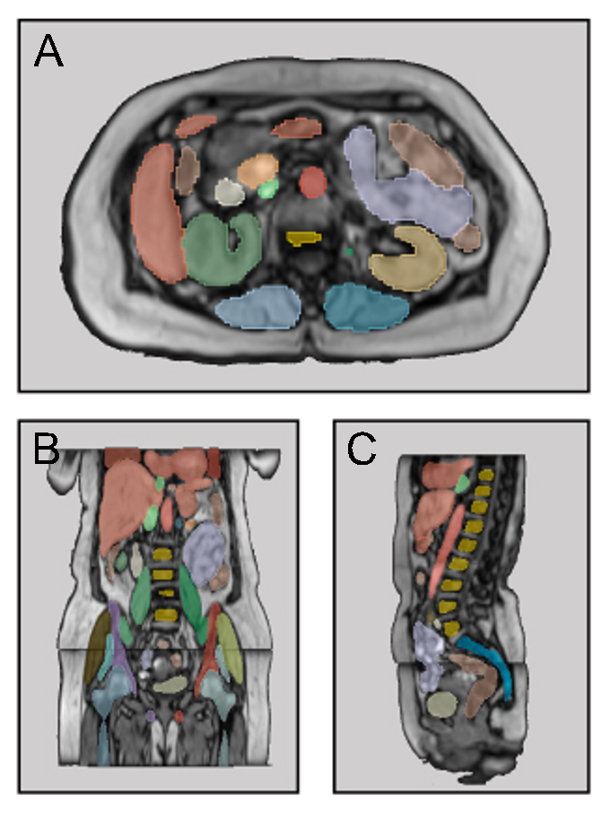

<h2 align="center"> MRSegmentator: Robust Multi-Modality Segmentation of 40 Classes in MRI and CT Sequences </h2>

***

<div align="center">
<a href="https://github.com/hhaentze/MRSegmentator/actions"></a>
<a href="https://github.com/hhaentze/MRSegmentator/blob/master/License.txt"></a>  
<a href="https://test.pypi.org/project/mrsegmentator"></a>  
<a href="https://github.com/psf/black"></a>
</div>

> Detect and segment 40 classes in MRI scans of the abdominal / pelvic / thorax region


Contrary to CT scans, where tools for automatic multi-structure segmentation are quite mature, segmentation tasks in MRI scans are often either focused on the brain region or on a subset of few organs in other body regions. MRSegmentator aims to extend this and accurately segment 40 organs and structures in human MRI scans of the abdominal, pelvic and thorax regions. The segmentation works well on different sequence types, including T1- and T2-weighted, Dixon sequences and even CT images. Read more about it in our preprint: https://arxiv.org/pdf/2405.06463.



## Installation
Install MRSegmentator with pip:
```bash
# Create virtual environment
conda create -n mrseg python=3.11 pip
conda activate mrseg

# Install MRSegmentator
python -m pip install mrsegmentator
```
(Optionally) If the installed pytorch version coming with nnunet is not compatible to your system, you might need to install it manually, please refer to [PyTorch](https://pytorch.org/get-started/locally/).

## Inference
MRSegmentator segments all .nii and .nii.gz files in an input directory and writes segmentations to the specified output directory. MRSegmentator requires a lot of memory and can run into OutOfMemory exceptions when used on very large images (e.g. some CT scans). You can reduce memory usage by setting ```--split_level``` to 1 or 2. Be aware that this increases runtime and possibly reduces segmentation performance.

```bash
mrsegmentator --input <nifti file or directory>
```

Options:
```bash
-i, --input <str> [required] # input directory or file

--outdir <str>  # output directory
--fold <int> # use only a single model for inference 
--postfix <str> # postfix that will be added to segmentations, default: "seg"
--split_level <int> # split images to reduce memory usage. Images are split recusively: A split level of x will produce 2^x smaller images.

--batchsize <int> # how many images can be loaded to memory at the same time, default: 8
--nproc <int> # number of processes
--nproc_export <int> # number of processes for exporting the segmentations
--cpu_only # don't use a gpu
--verbose
```

## Python API
```python
from mrsegmentator import inference
import os

outdir = "outputdir"
images = [f.path for f in os.scandir("image_dir")]
folds = [0]

inference.infer(images, outdir, folds)
```

## How To Cite
If you use our work in your research, please cite our preprint on arXiv: https://arxiv.org/pdf/2405.06463.
```
Hartmut Häntze, Lina Xu, Felix J. Dorfner, Leonhard Donle, Daniel Truhn, Hugo Aerts, Mathias Prokop, Bram
van Ginneken, Alessa Hering, Lisa C. Adams, and Keno K. Bressem. MRSegmentator: Robust multi-modality
segmentation of 40 classes in MRI and CT sequences. arXiv, 2024.
```


## Class details

|Index|Class|
| :-------- | :------- |
| 0 | background |
| 1 | spleen |
| 2 | right_kidney |
| 3 | left_kidney |
| 4 | gallbladder |
| 5 | liver |
| 6 | stomach |
| 7 | pancreas |
| 8 | right_adrenal_gland |
| 9 | left_adrenal_gland |
| 10 | left_lung |
| 11 | right_lung |
| 12 | heart |
| 13 | aorta |
| 14 | inferior_vena_cava |
| 15 | portal_vein_and_splenic_vein |
| 16 | left_iliac_artery |
| 17 | right_iliac_artery |
| 18 | left_iliac_vena |
| 19 | right_iliac_vena |
| 20 | esophagus |
| 21 | small_bowel |
| 22 | duodenum |
| 23 | colon |
| 24 | urinary_bladder |
| 25 | spine |
| 26 | sacrum |
| 27 | left_hip |
| 28 | right_hip |
| 29 | left_femur |
| 30 | right_femur |
| 31 | left_autochthonous_muscle |
| 32 | right_autochthonous_muscle |
| 33 | left_iliopsoas_muscle |
| 34 | right_iliopsoas_muscle |
| 35 | left_gluteus_maximus |
| 36 | right_gluteus_maximus |
| 37 | left_gluteus_medius |
| 38 | right_gluteus_medius |
| 39 | left_gluteus_minimus |
| 40 | right_gluteus_minimus |